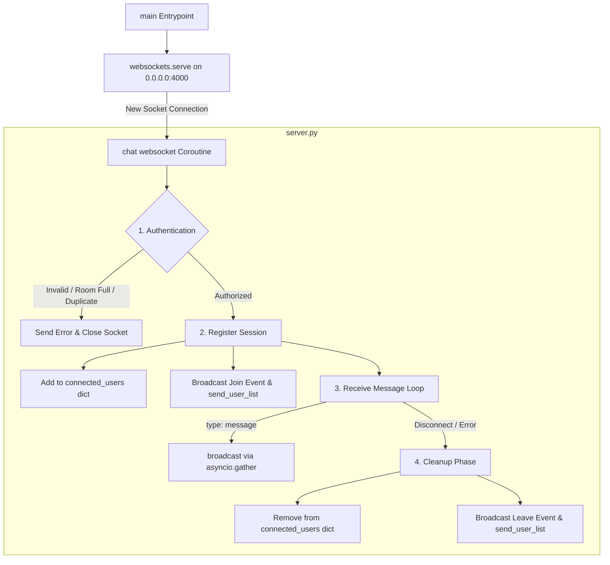

# Real-Time Group Chat Application

A lightweight real-time **Group Chat Application** built using **Python WebSockets, HTML, CSS, and JavaScript**.

The application provides real-time communication between the four authorized members of the group.

---

## Project Structure

```text
group-chat/
│
├── server.py
│
├── README.md
│
└── client/
    ├── index.html
    ├── style.css
    └── app.js
```

---

## Server Architecture (`server.py`)

The backend server (`server.py`) is an **asynchronous event-driven WebSocket server** built using Python's `asyncio` engine and the `websockets` library.



### Core Components & Functions

1. **Global Configuration & State**
   - **`AUTHORIZED_USERS`**: Whitelist mapping authorized usernames to their access codes.
   - **`connected_users`**: Global dictionary mapping active WebSocket connection objects to user metadata (`username`, `ip`).
   - **`MAX_USERS`**: Capacity limit constant set to 4 simultaneous connections.

2. **Key Functions & Coroutines**
   - **`main()`**: Server startup function that initializes `websockets.serve(chat, HOST, PORT)` and runs the infinite `asyncio` event loop.
   - **`chat(websocket)`**: Main per-client coroutine handling the full lifecycle: authentication handshake, active message loop, and disconnection cleanup.
   - **`broadcast(data)`**: Serializes JSON data and sends it concurrently to all active clients in `connected_users` using `asyncio.gather(*..., return_exceptions=True)`.
   - **`send_json(websocket, data)`**: Helper to serialize and transmit a JSON message to a single target WebSocket client.
   - **`send_user_list()`**: Extracts all active usernames from `connected_users` and broadcasts the updated online user roster.

---

## Requirements

Before running the application, make sure Python 3 is installed.

Check Python:
```bash
python --version
```

Install the required WebSocket package:
```bash
pip install websockets
```

If `pip` is not available:
```bash
pip3 install websockets
```

---

## Setup

Clone or copy the `group-chat` folder to the server.

Go to the project directory:
```bash
cd ~/group-chat
```

The project should contain:
- `server.py`
- `client/`

---

## Running the Application

The application requires two terminals on the server.

### Terminal 1 — Start the Backend

Go to the project directory:
```bash
cd ~/group-chat
```

Start the WebSocket server:
```bash
python server.py
```
or:
```bash
python3 server.py
```

The WebSocket backend runs on: `0.0.0.0:4000` in server

The server handles:
- User authentication
- WebSocket connections
- User management
- Message broadcasting
- Join notifications
- Leave notifications
- Client disconnections

---

### Terminal 2 — Start the Frontend

Open another terminal/SSH session.

Go to the client directory:
```bash
cd ~/group-chat/client
```

Start the HTTP server:
```bash
python -m http.server 5000 --bind 0.0.0.0
```

The frontend server runs on port: `5000`

---

## Access the Client URL

Open a web browser and visit:
[http://10.1.75.51:5213](http://10.1.75.51:5213)

The URL will open the User Login page. for authentication use the following credentials. After successful authentication, the user will be redirected to the group chat.

---

## Authorized Group Members

Only the following four members are authorized to access the application.

| No. | Username | Password |
|---|---|---|
| 1 | ganesh | 12341080 |
| 2 | venu | 12341110 |
| 3 | venkat | 12341070 |
| 4 | dheemanth | 12341710 |

### Example Login
- **Username:** `ganesh`
- **Password:** `12341080`

Users who are not in the authorized list cannot access the chat. Incorrect passwords will also be rejected.

---

## Application Features

- Real-time group messaging using WebSockets
- Authentication for the four group members
- Online users list
- Maximum of four simultaneous users
- User join notifications
- User leave notifications
- Real-time message broadcasting
- Current user's messages displayed on the right
- Other users' messages displayed on the left
- Graceful handling of client disconnections
- Responsive UI for desktop, tablet, and mobile devices
- Lightweight frontend without external frameworks

---

## Ports

The application uses two ports:

| Service | Port | URL / Address |
|---|---|---|
| Frontend HTTP Server | `5000` | `http://10.1.75.51:5213` |
| WebSocket Backend | `4000` | `ws://10.1.75.51:4213` |


---

## WebSocket Communication

The frontend communicates with the Python backend using a persistent WebSocket connection.

```text
               WebSocket Server
                 Python : 4213
                      │
       ┌──────────────┼──────────────┐─────────┤
       │              │              │         │
       ▼              ▼              ▼         ▼
    Ganesh          Venu          Venkat    Dheemanth
```

Messages sent by one user are broadcast by the server to all connected users.


---

## Application Flow

```text
User opens: http://10.1.75.51:5213
        │
        ▼
   Login Page
        │
        ▼
Username + Password
        │
        ▼
Server Authentication
        │
    ┌───┴────┐
    │        │
  Valid    Invalid
    │        │
    ▼        ▼
 Chat      Reject
    │
    ▼
WebSocket Connection
    │
    ▼
Send / Receive Messages
    │
    ▼
Server Broadcasts
    │
    ▼
All Connected Users
```

---

## Group Members

This application was developed as a group project with four authorized members:
- Ganesh
- Venu
- Venkat
- Dheemanth

---

## Conclusion

The project demonstrates a lightweight real-time communication system using Python WebSockets with a responsive web-based frontend.

The centralized WebSocket server manages authentication, connections, online users, and real-time message broadcasting for the four authorized group members.